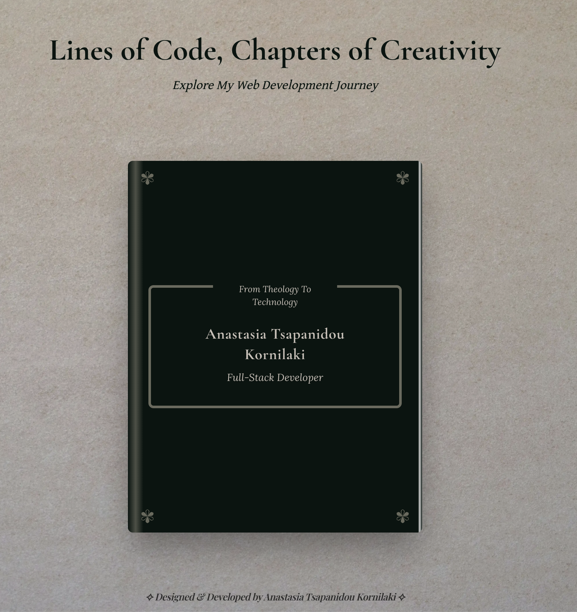

  

<h1 align="center">📚 Developer's Storybook</h1>

  <i>A developer’s journey told like a novel — one chapter, one commit at a time.</i>

  <!-- 🍃 Earthy badge stack -->
  
  
  
  
  
   
  
  
  
  

---

## 📖 About the Project

Welcome! I’m **Anastasia Tsapanidou Kornilaki**, a web developer with a passion for both **technology and design**.  
This portfolio is my way of telling a story — not just of the work I’ve done, but the path I’ve taken.

My journey didn’t begin in tech — it began in **Theology**, where I learned to think deeply and observe curiously.  
Over time, my fascination with how websites were built led me to discover web development — a space where **problem-solving, creativity, and logic** come together in perfect harmony.

This portfolio is structured like a book: each chapter represents a part of my evolution — from bootcamp projects to internship experience, and on to my current role in the field.  
With every line of code, I continue learning, adapting, and writing new chapters in my story.

> _“Thank you for stepping into my world of code and creativity. I hope you find inspiration in these pages as I continue to write my story, one keystroke at a time.”_

---

## 🧠 Tech Stack

- **Next.js** – React framework
- **Tailwind CSS** – Utility-first styling with responsive design
- **TypeScript** – Type-safe, scalable JavaScript
- **Framer Motion** – Smooth, accessible animations and transitions
- **Lucide Icons** – Elegant icon system

---

## 🗂️ Layout & Chapters

> _"Every chapter is a milestone — here's how the story unfolds:"_

- **📘 Cover Page** – Project title, tagline, and author
- **✍️ Prologue** – Live handwriting animation as an author’s personal note
- **📖 Table of Contents** – Quick navigation between sections
- **Chapter I: The Bootcamp** – My early projects and JavaScript foundations
- **Chapter II: The Internships and solo projects** – Hands-on experience and teamwork
- **Chapter III: Professional Work** – My work as a full-stack developer
- **🧾 Digital Lexicon** – A glossary of tools & technologies used
- **💌 Correspondence Chamber** – Contact form + links
- **🖋️ Author’s Note** – The about-me story in final form

Each chapter includes:

- ✏️ Personal story or insight
- 🛠️ Technologies used
- 🔗 Links to code & live demos
- 📸 Screenshots or project visuals

---

## 🌍 Responsiveness

The layout gracefully adapts to all devices, ensuring a seamless and elegant experience whether viewed on a wide monitor or a mobile screen. Every detail has been considered — typography, spacing, and visibility.

---

## 🎨 Design Philosophy

- 📖 Inspired by physical books — from chapter layout to textured pages
- ✨ Subtle animations, smooth transitions, and a live handwriting Prologue
- 🧩 Modular component structure for clean expansion
- 🎯 User-first focus on clarity, tone, and aesthetic performance
- ⚖️ Balanced design system that blends code and creativity

---

## 📬 Contact

Want to connect, collaborate, or simply say hi?

- ✉️ [Email](mailto:natassakorn@gmail.com)  
- 🌐 [LinkedIn](https://www.linkedin.com/in/anastasia-natassa-tsapanidou-kornilaki-a2b052191/)  
- 💻 [GitHub](https://github.com/natko22)

---

## 🖋️ Author

Crafted with love, caffeine, and React  
by **Anastasia Tsapanidou Kornilaki**

---

## 🔒 License

This project is licensed under the **Creative Commons** — feel free to explore, learn from, or share it with credit.

---

> _“Not just code — a chronicle.”_
